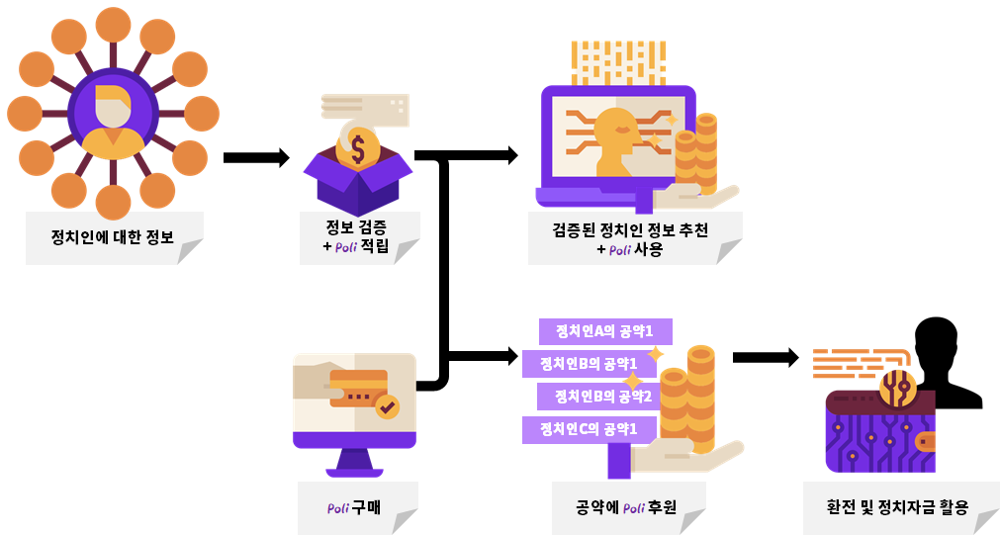
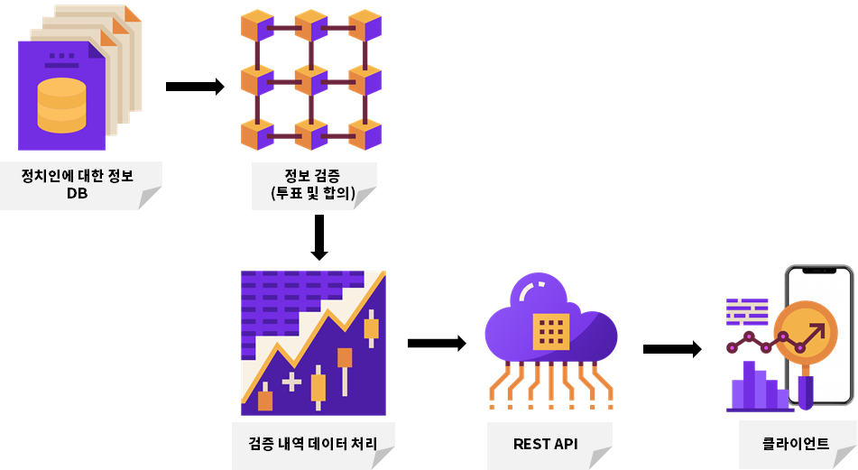
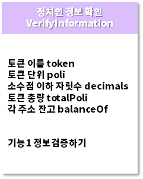
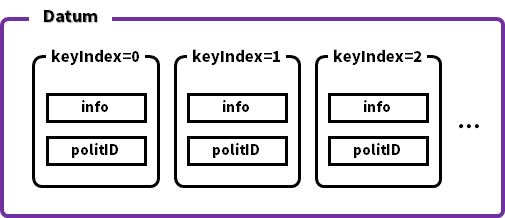

# Poli_WiKi

 

## Service Process

 

## System Structure

 

## Smart Contracts

 

- 정치인 정보 생성 `Make_Information.sol`
  - 문자열 저장 계약

  

   

- 정치인 정보 확인 `Verify_Information.sol`
  - 가상 화폐 계약

  